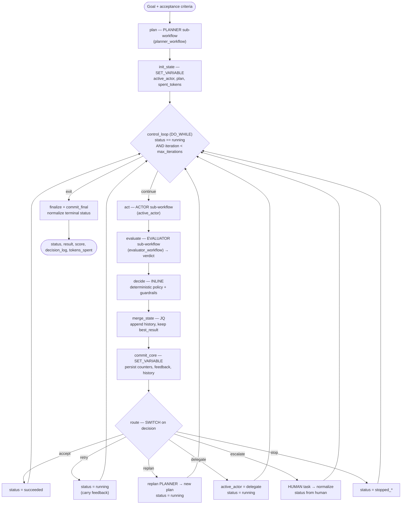

# Loop Engine — Loop Engineering for Agents on Conductor

> **Agents perform the work. Engineered loops make the work dependable.**

> **A showcase of [Conductor](https://github.com/conductor-oss/conductor) and the
> [Conductor skills](https://github.com/conductor-oss/conductor-skills).** Loop Engine is built
> end-to-end on open-source Conductor — durable workflows, built-in system tasks, the
> `LLM_CHAT_COMPLETE` task, and SDK workers — and authored with the Conductor skills. It is meant
> to be read as a worked example of how far you can take agentic, production-grade control on
> Conductor. See **[Built on Conductor](#built-on-conductor)** below.

This is a durable, observable, bounded **outer loop** for AI agents, built as a system of
Conductor workflows. Instead of a human repeatedly running an agent, inspecting the result,
giving feedback, and asking it to try again, that supervision is turned into software.

The control loop is one workflow (`loop_engine`). The judgment-heavy parts — planning, acting,
evaluating — are **extension points**: each is a separate sub-workflow you swap by name at
runtime. The control logic (decision policy, guardrails, state, termination) stays deterministic
in the engine. *Use agents for judgment; use workflows for control.*

```
Goal
  ↓
Planner            (loop_planner — extension point)
  ↓
┌──────────────── control_loop (DO_WHILE, durable, capped) ────────────────┐
│  Actor          (loop_actor — extension point)                           │
│    ↓                                                                     │
│  Evaluate       (loop_evaluator / loop_demo_text_evaluator — ext. point) │
│    ↓            → verdict {passed, score, feedback}                      │
│  Decide         (deterministic policy + guardrails, INLINE)              │
│    ↓                                                                     │
│  Route ── accept · retry · replan · delegate · escalate · stop           │
│    ↓                                                                     │
│  Persist state  (history, best_result, counters, tokens — variables)     │
└──────────────────────────────────────────────────────────────────────────┘
  ↓
Finalize → { status, result, score, decision_log, tokens_spent }
```

## The eight components of loop engineering, and where each lives

| Loop-engineering component | Where it is implemented |
|---|---|
| **1. Objective** | `objective` + `acceptance_criteria` workflow inputs |
| **2. Agent** | `loop_actor` (swappable via `actor_workflow`) |
| **3. Environment** | Whatever the actor/evaluator sub-workflows call — LLMs, MCP tools, HTTP, vector DBs |
| **4. Observation** | The actor's `result` + the evaluator's deterministic `checks` (evidence, not self-report) |
| **5. Evaluation** | `loop_evaluator` (LLM judge) or `loop_demo_text_evaluator` (deterministic checks **gate** an LLM judge) |
| **6. Decision policy** | `decide` (deterministic INLINE) → `route` (SWITCH) |
| **7. State & memory** | Workflow `variables`: `history`, `best_result`, `best_score`, `feedback`, `fail_streak`, `replans_used`, `spent_tokens` |
| **8. Termination** | `loopCondition` (status + iteration cap) + budget/no-progress/escalation rules in `decide` |

## The decision policy (deterministic, with guardrails)

The evaluator returns a verdict, but it does **not** decide what happens next — the engine does,
deterministically, in the `decide` task (canonical, unit-tested source: [`src/decide.js`](src/decide.js)).
Priority order:

1. `passed` on a healthy iteration → **accept** (status `succeeded`)
2. token budget exhausted → **escalate** (if human enabled) else **stop** (`stopped_budget`)
3. actor or evaluator **sub-workflow failed** (LLM outage, bad deploy) → bounded **infra retries**
   on a separate `infra_streak` counter; exhaustion → **escalate** (if human enabled) else **stop**
   (`stopped_infra_failure`). Infra failures never trigger a replan (a new strategy cannot fix a
   failing provider) and never pollute the quality fail streak.
4. evaluator explicitly recommends → **delegate** (switch `active_actor` to `delegate_actor_workflow`)
5. score improved beyond a threshold → **retry** with feedback (progress; reset fail streak)
6. no progress, fail streak `< max_retries` → **retry** with feedback
7. no progress, fail streak `≥ max_retries`:
   - replans remaining → **replan** (new strategy from the planner; reset fail streak)
   - else human enabled → **escalate**
   - else → **stop** (`stopped_no_progress`)

Separation of concerns is deliberate: the **actor** produces work, an **independent evaluator**
judges it, and the **engine** owns the control decision. An actor never marks its own work
complete.

## Evidence over self-report

`loop_demo_text_evaluator` shows the core principle. It runs **deterministic checks** (character
limit, required keywords, banned words) and an **LLM quality judge**, then:

```
passed = deterministic_checks_pass  AND  judge_score >= 0.7
```

Even if the LLM judge loves the tagline, if the deterministic character count says it's 240
chars against a 200 limit, `passed` is `false` and the loop retries with the exact, machine-
measured feedback ("Too long: 240 chars, limit 200 (cut 40). Missing required keyword: durable.").

## Effort modes — scaling the loop for open-ended problems

`effort` (`default` | `medium` | `high`, case-insensitive, `med` accepted) sets how much work the
loop may do. It is a **preset, not a mandate**: any knob you pass explicitly always overrides it.
The resolved configuration is validated, clamped to sane ranges, echoed in the output as `config`,
and the effort level flows to every extension point (as an `effort` input), so actors/planners
scale their own output budgets too.

| Knob | `default` | `medium` | `high` |
|---|---|---|---|
| `max_iterations` | 6 | 12 | 24 |
| `max_retries` | 3 | 4 | 5 |
| `max_replans` | 1 | 2 | 3 |
| `token_budget` | 200k | 500k | 2M |
| default actor `maxTokens` | 2000 | 3000 | 4500 |
| default planner `maxTokens` | 1200 | 1800 | 2400 |

A minimal run needs only `objective`, `acceptance_criteria`, `llm_provider`, `llm_model` — planner,
actor, evaluator, and every guardrail default sensibly (see `inputs/demo-minimal.json`). Missing
required inputs **terminate immediately** with a precise error instead of silently looping zero times.

## Guardrails / termination conditions

Every loop is bounded. Configured per run via inputs (unset knobs come from the `effort` preset;
all values clamped — e.g. `max_iterations` to 1..200 — so bad input can never create an unbounded loop):

| Input | Meaning |
|---|---|
| `max_iterations` | Hard cap on loop turns (also enforced in `loopCondition`) |
| `max_retries` | Consecutive no-progress attempts before replanning/escalating; also caps consecutive infra failures |
| `max_replans` | How many times the planner may re-strategize before stopping/escalating |
| `token_budget` | Cumulative planner+actor+evaluator token cap; exceeding it stops or escalates. `0` disables (explicitly) |
| `enable_human` | If true, exhaustion escalates to a `HUMAN` task instead of stopping |
| `escalate_on_limit` | If true, budget exhaustion escalates (when human enabled) rather than stopping |

The workflow definition itself carries a fixed wall-clock backstop (`timeoutSeconds`: 24h — sized
so a human escalation can wait; the iteration/budget caps are the real run-length guards) and a
`failureWorkflow` (`loop_failure_handler`) that fires if the engine itself ever dies, recording the
failed run for triage. Note the budget is checked after each iteration's spend, so it can overshoot
by at most one iteration.

## The workflows (system)

| Workflow | Role | Extension point input |
|---|---|---|
| `loop_engine` | The engineered outer loop / control plane | — |
| `loop_planner` | Default Planner: produces/revises strategy | `planner_workflow` |
| `loop_actor` | Default Actor: produces one attempt | `actor_workflow`, `delegate_actor_workflow` |
| `loop_evaluator` | Default Evaluator: independent LLM judge | `evaluator_workflow` |
| `loop_demo_text_evaluator` | Evidence-based Evaluator: deterministic checks gate an LLM judge | `evaluator_workflow` |
| `loop_failure_handler` | `failureWorkflow`: records an engine-level failure for triage (extend with notification tasks) | — |

Each extension point is invoked as a `SUB_WORKFLOW` whose **name is resolved from input (or a
variable) at runtime** — verified to work on this server. To plug in your own implementation,
register a workflow with the same I/O contract (below) and pass its name.

### Extension-point I/O contracts

**Planner** — in: `objective, acceptance_criteria, context, feedback, history, effort, llm_provider, llm_model, extension_params`; out: `{ plan, tokens }`

**Actor** — in: `objective, acceptance_criteria, plan, context, feedback, iteration, history, effort, llm_provider, llm_model, extension_params`; out: `{ result, summary, tokens }`

**Evaluator** — in: `objective, acceptance_criteria, result, summary, context, effort, llm_provider, llm_model, extension_params`; out: `{ passed, score, feedback, recommend, checks, tokens }`

The engine treats a sub-workflow that fails — or returns an all-null verdict / no `result` — as an
**infra failure** (bounded retries, see decision policy), so a buggy custom extension degrades
gracefully instead of killing the run. By default the evaluator runs on the **same model** as the
actor; pass `evaluator_llm_model` to decorrelate the judge from the generator (recommended in
production — correlated generator/evaluator pairs share blind spots).

`extension_params` is a free-form object passed through to all three, so a custom extension can
read whatever config it needs (the text evaluator reads `max_chars`, `required_keywords`,
`banned_words` from it).

## Run

```bash
# Minimal: objective + criteria + model; everything else defaulted (effort preset)
conductor workflow start -w loop_engine -f inputs/demo-minimal.json

# Evidence-based demo (deterministic checks gate the LLM judge)
conductor workflow start -w loop_engine -f inputs/demo-tagline.json

# Generic LLM-judge demo (swap evaluator_workflow -> loop_evaluator)
conductor workflow start -w loop_engine -f inputs/demo-generic.json

# Inspect a run
conductor workflow get-execution <workflowId>
```

Output shape:

```json
{
  "status": "succeeded | stopped_no_progress | stopped_budget | stopped_max_iterations | stopped_infra_failure | escalated",
  "result": "<the best deliverable produced>",
  "score": 0.0,
  "iterations": 3,
  "last_decision": "accept",
  "decision_log": [ { "iteration": 0, "score": 0.0, "passed": false, "decision": "retry", "reason": "...", "feedback": "...", "tokens_total": 3210 } ],
  "tokens_spent": 12345,
  "final_plan": "...",
  "termination_reason": "...",
  "config": { "effort": "default", "max_iterations": 6, "...": "resolved + clamped knobs, echoed for observability" }
}
```

## Demos (in `inputs/`) — each exercises a different loop behavior

| Input file | What it shows | Observed outcome |
|---|---|---|
| `demo-tagline.json` | Evidence-based eval (deterministic gate + judge), ≤120 chars | `succeeded` on iter 1 — accepts the moment deterministic evidence confirms the criteria |
| `demo-tagline-hard.json` | Banned-word evidence (`agent`/`ai`/`llm` forbidden) | `succeeded` — model rephrased to "autonomous software", deterministically verified |
| `demo-length-window.json` | Exact length window (150–170 chars) — the "models can't count" case | `succeeded` at 163 chars — deterministic length check is authoritative |
| `demo-generic.json` | Swaps in the **generic LLM-judge** evaluator (`loop_evaluator`) | `succeeded` — proves the evaluator extension point is swappable |
| `demo-bounded-stop.json` | Impossible constraint (5 keywords in 30 chars) | `stopped_max_iterations` after `retry → retry → retry → replan → retry` — **bounded termination, no infinite loop** |
| `demo-minimal.json` | Minimal input + `effort: medium` — every other knob defaulted by the engine | `succeeded` — defaults + presets carry the run |
| `demo-infra-failure.json` | Actor points at a **nonexistent workflow** | `stopped_infra_failure` after bounded infra retries — an outage degrades gracefully instead of failing the run |

The decision log from `demo-bounded-stop.json` is the clearest demonstration of the engineered
loop: it tried, took machine-precise feedback each turn, **replanned** when retries hit the cap,
and **halted at the iteration guardrail** instead of spinning forever.

## Extending the loop

- **New actor** (e.g. an MCP/ReAct agent, a coding agent): register a workflow honoring the Actor
  contract, pass `actor_workflow: "your_actor"`. See the Conductor skill's `ai-agent-loop` example
  for an MCP/ReAct actor body.
- **New evaluator** (e.g. run a test suite, call a policy API, compile code): register a workflow
  honoring the Evaluator contract. Prefer deterministic checks; gate the LLM judge with them.
- **Human-in-the-loop**: set `enable_human: true`. On escalation the loop pauses at a `HUMAN`
  task; resume with `conductor task signal` providing `{ "status": "running", "feedback": "..." }`
  to continue (with new guidance) or `{ "status": "stopped" }` to halt.
- **Delegate**: have an evaluator return `recommend: "delegate"`; the loop switches `active_actor`
  to `delegate_actor_workflow` for the remaining iterations.

## Flow (`loop_engine`)



## Production examples (`examples/`)

Three real-world loops that reuse this engine unchanged — each just supplies an actor +
evaluator and (for two of them) **Python workers** that do the real work. See
[`examples/README.md`](examples/README.md).

| # | Example | What plugs in | Evidence the loop closes on |
|---|---------|---------------|------------------------------|
| 1 | **Coding agent** | LLM writes Python; generic `python_code_runner` worker executes it | real test pass/fail (sandboxed subprocess) |
| 2 | **Data-quality pipeline** | `clean_dataset` + `data_quality_check` workers | deterministic data contract |
| 3 | **Refund / support agent** | `account_lookup` + `issue_refund` + `verify_refund` workers | the actual refund ledger, not the model's claim |

```bash
cd examples && ./register.sh                 # task defs + workflows (idempotent)
(cd workers && python run_workers.py) &       # start the 6 Python workers
conductor workflow start -w loop_engine -f 01-coding-agent/inputs/roman-numerals.json
```

## Failure handling (the loop survives its own infrastructure)

The `plan`, `act`, `evaluate`, and `replan` sub-workflow calls are all **optional + guarded**:

- **Planner fails** → the loop proceeds with an explicit "no plan" instruction instead of dying.
- **Actor fails** (LLM outage, unregistered workflow, timeout) → the iteration is recorded as an
  infra failure with INFRA feedback; bounded retries via `infra_streak`; a failed attempt can never
  become `best_result` or be accepted.
- **Evaluator fails / returns an all-null verdict** → same infra path; a missing verdict is never
  interpreted as pass *or* fail quality signal.
- **Replanner fails** → the previous plan is kept and the loop continues.
- **The engine itself fails** (wall-clock timeout, unrecoverable error) → `loop_failure_handler`
  runs as the `failureWorkflow`, recording the run id/reason — extend it with HTTP/event tasks to
  page an operator.

Try it: `conductor workflow start -w loop_engine -f inputs/demo-infra-failure.json` points the
actor at a workflow that does not exist and terminates cleanly with `stopped_infra_failure`.

## Bounded state (long runs cannot blow up workflow variables)

- Evaluator feedback is truncated to 2,000 chars before persisting (`src/eval_guard.js`).
- `decision_log` history keeps the most recent **50** entries.
- `best_result` is only ever replaced on a healthy, better-scoring iteration.
- Large artifacts (datasets, codebases) should be passed **by reference** (object store / external
  payload storage) in custom actors — the default examples keep deliverables small.

## Development: tests & build

The judgment-free logic is plain code with unit tests, not just JSON:

```bash
node --test 'tests/*.test.cjs'                      # decision policy, config resolution, verdict guard, JSON sync
(cd examples/workers && python3 -m unittest discover)   # all 6 Python workers
```

`src/decide.js`, `src/resolve_config.js`, `src/eval_guard.js` are the canonical sources for the
engine's INLINE tasks. After editing them run `node scripts/build.mjs` to re-inline into
`workflows/loop_engine.json`; the test suite fails (`scripts/build.mjs --check`) if the JSON drifts.

## Design notes / Conductor specifics

- All tasks are **built-in system tasks** — no custom workers, so nothing hangs on an unregistered
  worker. The only deliberate wait is the `HUMAN` escalation task.
- LLM calls use the built-in `LLM_CHAT_COMPLETE` task (provider/model via input), never HTTP-to-
  provider.
- Evaluator output is parsed defensively in INLINE (`jsonOutput: false` + fence-stripping) — robust
  for Anthropic, which tends to wrap JSON in markdown fences.
- LLM judges treat the result under evaluation as **delimited untrusted data** (`<<<RESULT_START>>>`
  markers + explicit instruction), hardening against prompt injection from the actor's output. For
  high-stakes loops, prefer deterministic evaluators that *gate* the judge.
- State that must span iterations lives in workflow `variables`; it survives a restart. Each loop
  iteration is a durable checkpoint.
- Sub-workflow calls pin `version: 1` — Conductor requires a resolvable version when the
  sub-workflow **name is dynamic** (resolved from input at start time). Register extension-point
  changes as updates to version 1, or bump the pinned version here deliberately as part of a
  compatibility-reviewed release.

## Built on Conductor

Loop Engine is a **showcase of [Conductor](https://github.com/conductor-oss/conductor)** — the
open-source orchestration platform — and the
**[Conductor skills](https://github.com/conductor-oss/conductor-skills)** used to build on it.
Everything here is the platform doing the heavy lifting; the loop is the *pattern*, Conductor is
the *runtime*.

| What it demonstrates | Conductor primitive used |
|---|---|
| Durable, restart-surviving control loop | `DO_WHILE` + workflow `variables` as checkpointed state |
| Deterministic decision policy & routing | `INLINE` (graaljs) + `SWITCH` — no LLM in the control path |
| Swappable planner / actor / evaluator | `SUB_WORKFLOW` with a **dynamically resolved name** |
| LLM calls without bespoke HTTP plumbing | built-in `LLM_CHAT_COMPLETE` task |
| Real work behind the agents | SDK **workers** (`conductor-python`) + task definitions |
| Survives its own infrastructure | `optional` tasks, guard `INLINE`s, and a `failureWorkflow` |
| Fail-fast on bad input / human-in-the-loop | `TERMINATE` and `HUMAN` system tasks |
| Bounded cost & termination | task `timeoutSeconds`, retries, and token-budget guards |

- **Conductor (server, SDKs, system tasks):** <https://github.com/conductor-oss/conductor>
- **Conductor skills (build, run, review workflows from your agent/CLI):**
  <https://github.com/conductor-oss/conductor-skills>

To run Loop Engine you need a reachable Conductor server (`conductor server start` locally, or set
`CONDUCTOR_SERVER_URL`) with an LLM integration configured. Register the workflows, point the
engine at an objective, and inspect the durable execution — every iteration is a checkpoint you can
replay and audit in the Conductor UI.
